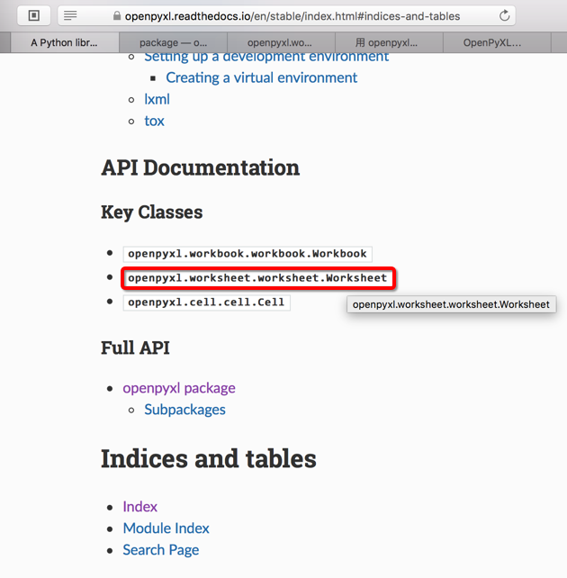
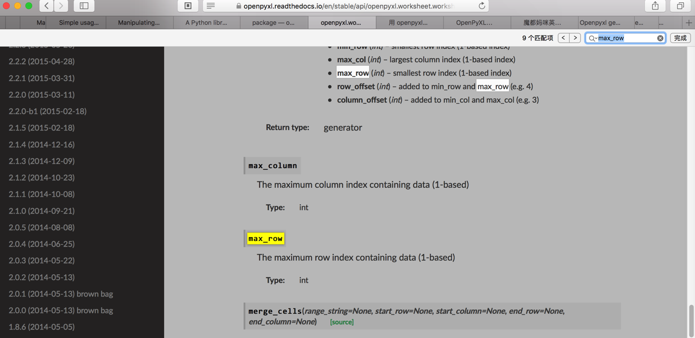

# 如何学习新知识

## 学习新知识的方法

遇到一个新知识，要先把几个几个核心要点问题搞清楚：

* `what`：搞清楚一个东西**是什么**
* `why`和`when`
  * `why`：一个东西**为何**出现
    * 往往涉及到该东西出现的背景和缘由
  * `when`：一个东西**何时**出现
    * 从出现的时间范围，往往也有助于理解其前后因果关系
* `how`：**如何**实现这个东西，具体是怎么做的，大致原理

把这几个问题都解释清楚了，也就对一个东西有了大致的了解了。

## 学习新知识的步骤

核心思路：找到最权威的官网的资料，去参考官网教程去学习

比如：

* `scrapy`
* `Django`
* `ReactJS`
    * 官网教程的众多好处：
        * 权威，够准确
            * 内容解释更加到位
        * 内容最及时
            * 尤其是React等发展比较快的技术，最新的文档往往最有价值

### 举例：获取openpyxl当前excel的sheet的最大的行row数

在用Python的openpyxl去处理excel文件：

[【已解决】python解析excel文件并读取其中的sheet和row和column的值](http://www.crifan.com/python_parse_excel_extract_sheet_row_column_value)


期间，需要找到openpyxl中，如何获得当前excel的sheet的最大的行（row）数

根据经验，确信官网文档：

[openpyxl - A Python library to read/write Excel 2010 xlsx/xlsm files — openpyxl 2.5.0 documentation](https://openpyxl.readthedocs.io/en/stable/index.html#indices-and-tables)

中是可以找到的

但是看了很多个具体的页面的example例子中：

[Simple usage — openpyxl 2.5.0 documentation](https://openpyxl.readthedocs.io/en/stable/usage.html#read-an-existing-workbook)

[Manipulating a workbook in memory — openpyxl 2.5.0 documentation](https://openpyxl.readthedocs.io/en/stable/tutorial.html#loading-from-a-file)

并没有找到。

思路：按照道理，这个最大的行数，应该属于当前的（excel的）sheet的，所以感觉应该属于sheet类中的

（背景知识：一般官网文档，除了turorial教程，example示例等，都还有API接口文档的）

所以就去找api文档：

[openpyxl package — openpyxl 2.5.0 documentation](https://openpyxl.readthedocs.io/en/stable/api/openpyxl.html)

中搜sheet方面的类。只有一个：

[openpyxl.comments.comment_sheet module](https://openpyxl.readthedocs.io/en/stable/api/openpyxl.comments.comment_sheet.html)

明显不是我要的。

然后继续利用google去搜：

Openpyxl  get current sheet max row

而找到了：

[python - Is it possible to get an Excel document's row count without loading the entire document into memory? - Stack Overflow](https://stackoverflow.com/questions/13377793/is-it-possible-to-get-an-excel-documents-row-count-without-loading-the-entire-d)

中的，我们要的：

```python
    row_count = sheet.max_row
    column_count = sheet.max_column
```

而反过来回到官网文档，突然才发现，原来官网文档首页：

[openpyxl - A Python library to read/write Excel 2010 xlsx/xlsm files — openpyxl 2.5.0 documentation](https://openpyxl.readthedocs.io/en/stable/index.html#indices-and-tables)

是有对应的类：



`openpyxl.worksheet.worksheet.Worksheet`

进去 [openpyxl.worksheet.worksheet module — openpyxl 2.5.0 documentation](https://openpyxl.readthedocs.io/en/stable/api/openpyxl.worksheet.worksheet.html) 后果然就可以搜到`max_row`的：



所以此处总结过程就是：

1. 首先要求自己：充分利用官网文档和Google搜索，可以帮忙我们快速精准的找到要的东西
2. 其次要求对方：官网文档首先要写的更清楚，准确，方便查找
3. 然后要求自己：看官网文档要足够细心，才能看准，看清，找到自己要的东西

而所有这一切，要有一些背景知识和经验：

1. 要知道很多好的库，往往文档也写的很好
    * 所谓文档写得好，至少意味着：
      * 文档和代码是同步的，不是滞后的
      * 文档要有清晰的简明的示例，即example，tutorial等内容
          * 用于给新手快速上手，了解如何使用
      * 也有相关的API接口文档
          * 当用户需要深入了解具体某个类有哪些功能、参数、属性、注意事项等，可以去查API文档
2. 要知道作为一般的技术人员的你，针对尤其是成熟的第三方的软件、系统、库等等，所遇到的绝大多数问题，往往别人都遇到过，往往别人都上网去讨论过，往往都有热心人回答过，而你要做事情只是：
   * 去充分利用google等去搜索到自己需要的内容
       * 当然如何去选择搜索的关键词，也是很重要的
           * 即使你不太会把当前问题提取出合适的关键词，往往google的动态匹配，给你合适的提示
       * 和google比，其他搜索引擎，比如百度，搜狗，bing等，对于搜索出的帖子的质量（相关程度，帖子回答的质等），都没google好，所以有条件的，尽量用google
