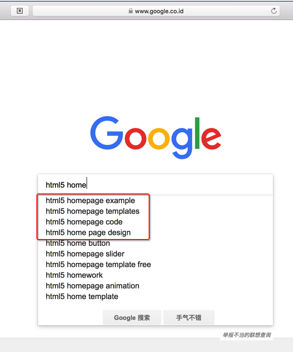
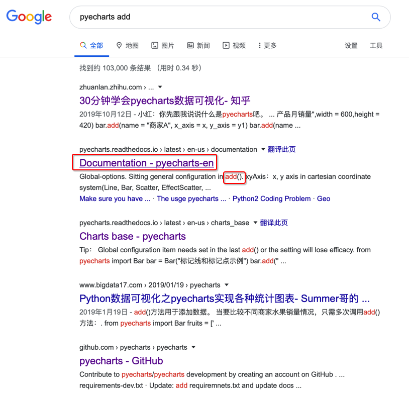
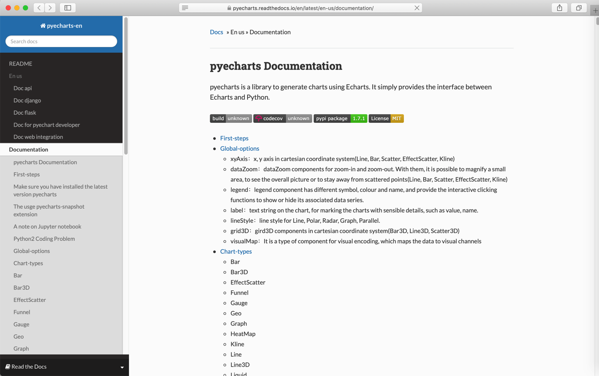
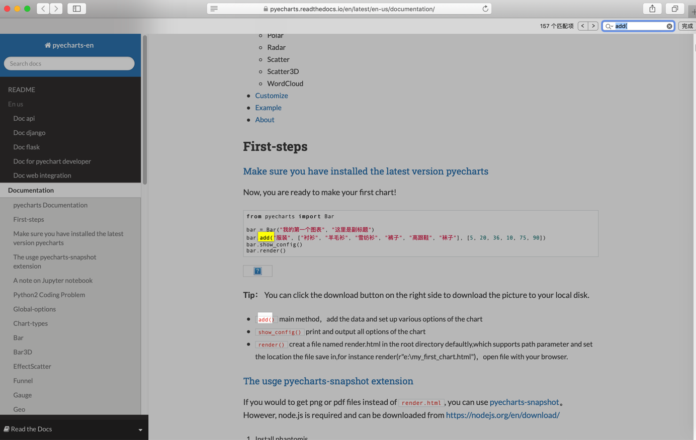
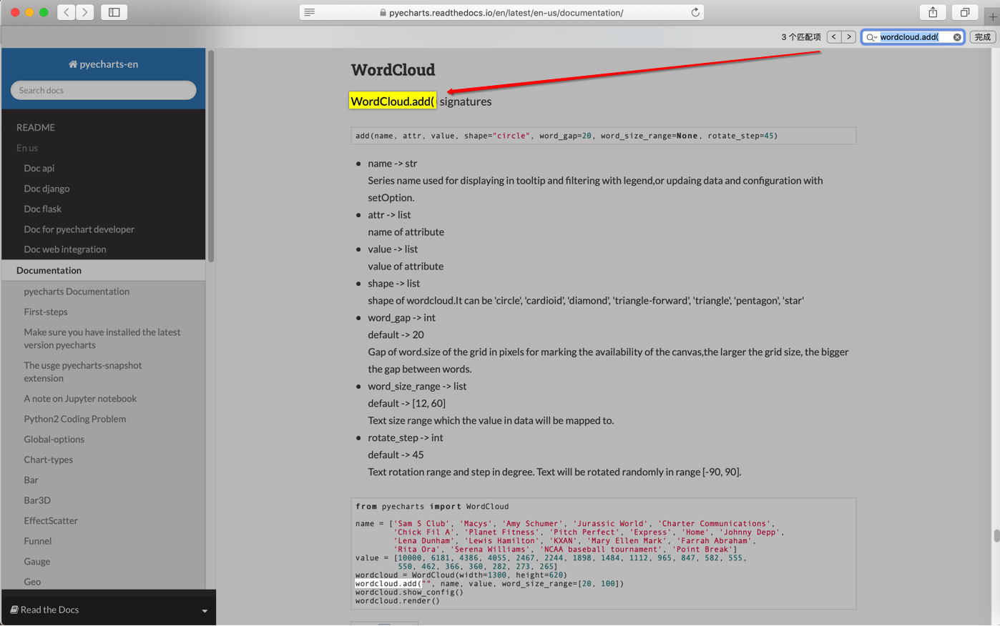
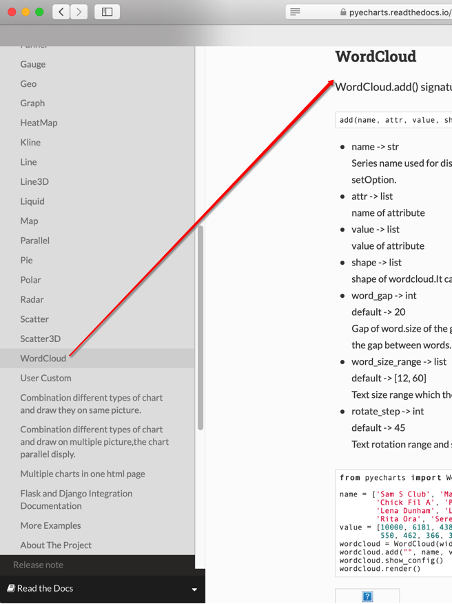

# Google

## 如何利用google搜索

用google搜索到你要的资料

核心要点是：搞清楚要搜索的**关键字**

如何知道要搜索什么呢？

需要较好的抽象思维和抓住问题要点，最终找到 问题核心关键词

下面就以举例方式来解释：

如何从问题入手，找到自己要搜的关键词

### 举例：html5的主页

比如：

【已解决】用什么技术实现公司官网首页H5页面

期间，对于想要用html5实现普通公司的主页，涉及到哪些技术和方法

但是除了知道应该搜索html5之外，不知道google中应该搜索什么关键词才比较合适。

然后此处就正好利用了google的动态匹配，达到了自己的目的

才刚搜了

`html5 home`

之后，google就动态匹配的列出来，我希望查询的关键字，尤其是列表开始的几个：

* html5 homepage example
* html5 homepage templates
* html5 homepage code
* html5 homepage design



然后接着就可以分别去搜这些关键字，从而最终找到自己想要找的内容了

比如搜：

`html5 homepage design`

找到相关的技术内容：


## 举例：pyecharts的wordcloud的add的函数定义

比如在回答

[关于Python pyecharts 的问题（已经找资料找了半天了）-CSDN论坛](https://bbs.csdn.net/topics/396136267)

的问题期间，对于别人代码：

```python
wordcloud.add("",name,values,word_size_range=[20,100],shape= "circle")
```

需要去找到`wordcloud.add`的函数的定义

此处已知是Python的pyecharts的库

所以去搜：

`pyecharts add`

或：

`python pyecharts add`

找到：



可见，第二个，一眼就能看出是**官网资料**

因为其网址是：

`pyecharts.readthedocs.io › latest › en-us › documentation`

这种地址

而（你需要具有，或逐渐熟悉）已知知识：

`readthedocs.io`是个存放Python的库的官网文档的一个网站

-》从而就能确定：这个资料，肯定是官网资料（之一）了。

进入后是：

[Documentation - pyecharts-en](https://pyecharts.readthedocs.io/en/latest/en-us/documentation/)



然后尝试在页面中直接搜：

`add(`

也的确会找到，很多个`add()`



但好像不是我们要的那个add函数的定义

-》至此，也还是不能一下子找到我们要的add函数的定义

但是能注意到：好像是pyecharts中，具体还分很多个功能模块

因为原问题中指的是wordcloud

然后此处就去搜索

`wordcloud.add(`

注：万一还有 其他xxxcloud.add，那么也可以去搜： `cloud.add(`，多找找看，也是可以找到此处的`wordcloud.add(` 的。

即可找到我们要的：



看到函数定义 `WordCloud.add() signatures` 是：

```python
add(name, attr, value, shape="circle", word_gap=20, word_size_range=None, rotate_step=45)
```

至此，完成目标任务：

找到此处`pyecharts`的(`wordcloud`的)`add`函数的定义

-》从而搞清楚：每个参数含义，以及如何传递参数

另外也注意到，左边的目录中有这个`WordCloud`



-》验证了之前的判断：`pyecharts`中有多个模块，`wordcloud`只是其中一个模块的推断。

## Google高级用法

关于google搜索技巧，想说的是：自己这么多年利用Google找资料，其实很少用到高级用法。

毕竟核心在于前面提到的，把你遇到的问题，提炼出准确的关键词，然后即可快速找到你要的内容。

当然，懂更多的搜索技巧，肯定是好事，能灵活运用，才能锦上添花。

下面总结一些Google高级的搜索技巧，供参考：

* 想要精确匹配，则用**引号**
  * "你要搜索的内容"
* 不想要搜索结果包含某些东西，用：**减号**`-`
  * "你要搜索的内容" - "要排除的内容"
* 使用**通配符**
  * **星号**`*`
    * 举例：
      * `"the most * examples of censorship"`
        * 结果包含：
          * `"the most outrageous examples of censorship"`
          * `"the most dangerous examples of censorship"`
          * `"the most prolific examples of censorship"`
          * 等等
  * **波浪号**`~`
    * 举例：
      * `the importance of ~censorship`
        * 等价于搜索：
          * `the importance of censorship`
          * 同时搜索censorship的相关词汇，比如：propaganda：
          * `the importance of propaganda`
* 站内搜索=指定只搜索某个网站：用`site:`
  * 举例：
    * `the purpose of education site:http://www.time.com/`
      * 只搜索网站`http://www.time.com/`中的`the purpose of education`
