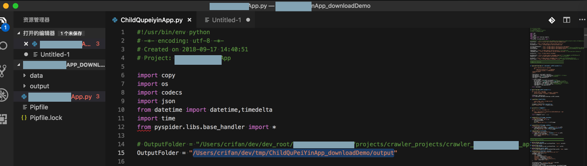

# 好习惯好逻辑

做事情要养成好的习惯和逻辑

下面举例说明：**什么叫好的习惯和逻辑**？

之前写了个爬虫，去爬取数据

其中需要保存爬取的数据到本地电脑中

* 好的习惯是：
  * 在第一次写代码时，就对于要保存的数据的路径，去提取出一个：
    * 全局的根目录
        * 后续保存数据都是放在根目录下的子目录
  * 这样做的好处是：
    * 万一，如果，后面的变更了要保存数据的路径
      * 只要改变一处即可，不用多个保存的路径都去修改
  * -> 随着后续开发，真的遇到这种需求：
    * 真的是只需要用同样代码，但是只是改动了爬取数据的保存路径即可。
      * 所以此时只需，不改动其他代码，而只是改变根目录：
        * 
      * 就能实现需求了